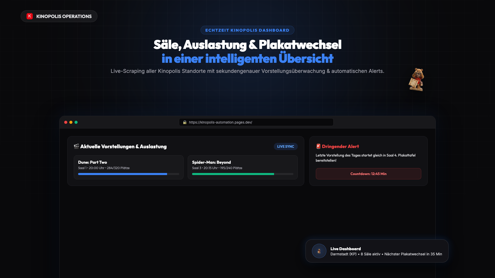
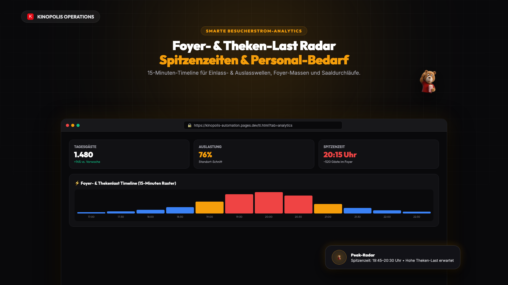
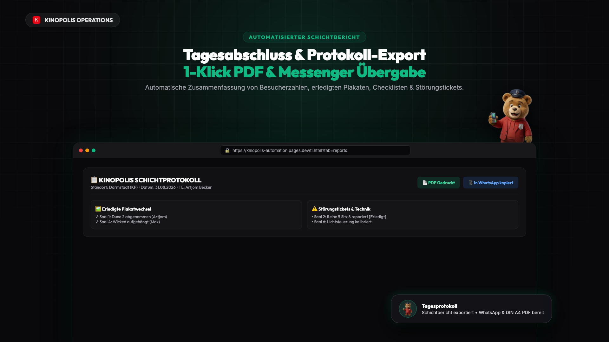
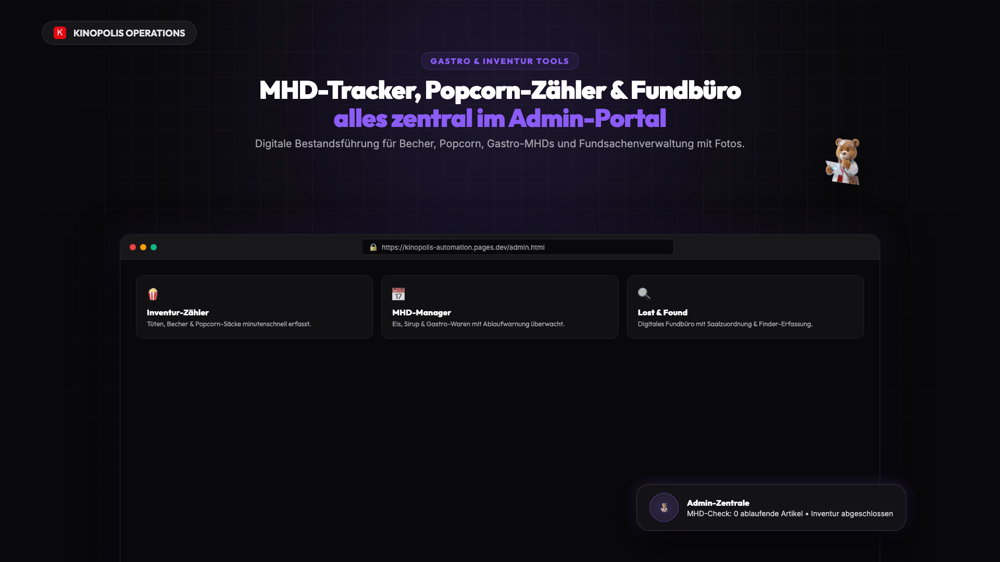
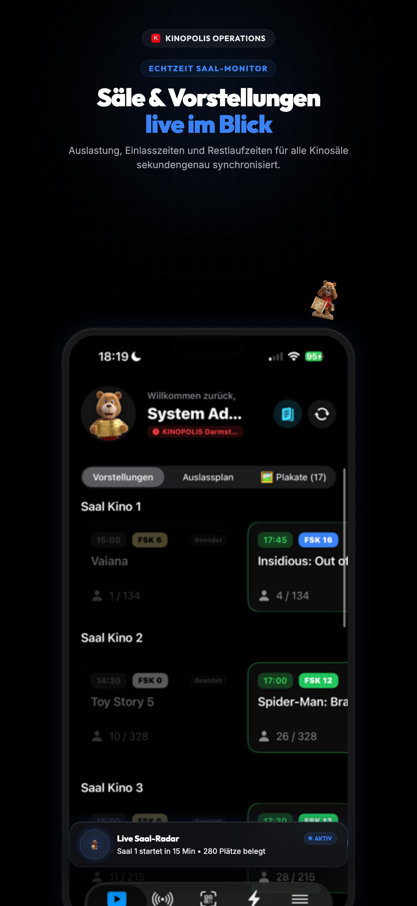
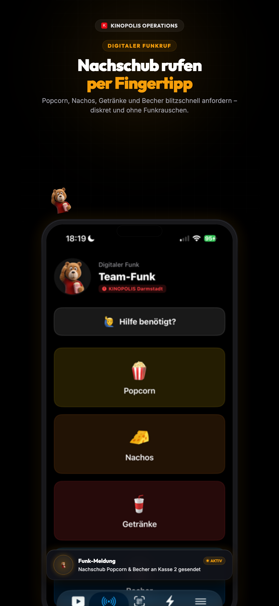
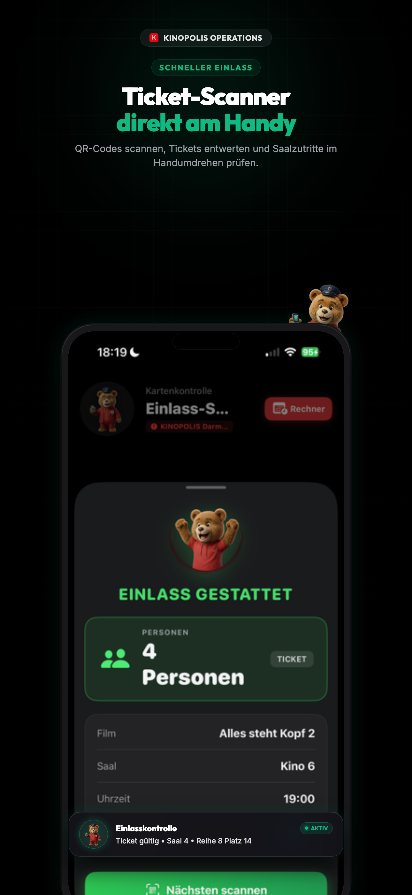
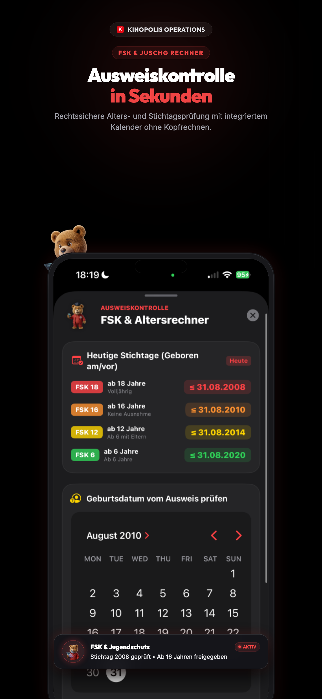
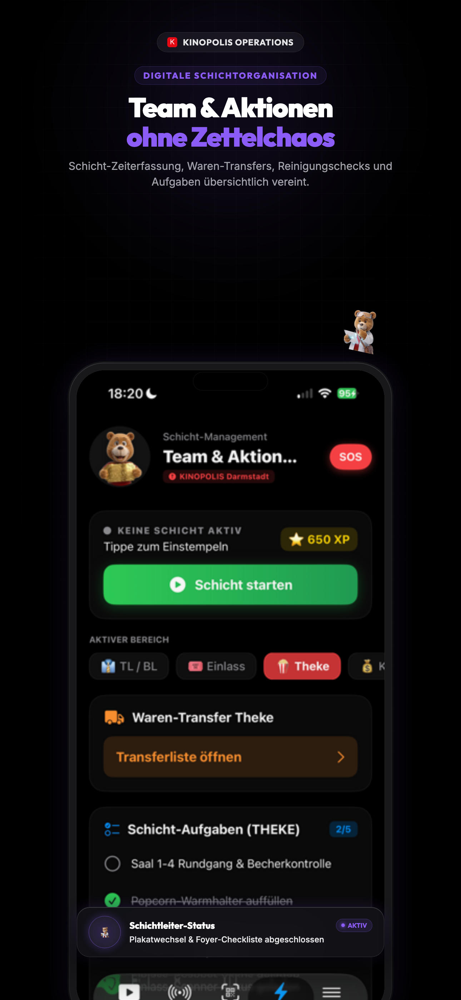

# Kinopolis Automation Suite 🎬🍿

> Modernes, reaktionsschnelles Kinobetriebs- & Automations-System für Kinopolis-Standorte. Vereint Live-Saalüberwachung, Smarte Foyer-Analytics, digitale Schichtberichte, Gastro-Inventur und mobile Workflows in einer Plattform.



---

## 📸 Desktop & Web Showcase

| 📊 Smarte Foyer-Analytics | 📑 Automatisierter Schichtbericht |
| :---: | :---: |
|  |  |

| 🖥️ Echtzeit Saal-Monitor | 🍿 Gastro & Admin Inventur |
| :---: | :---: |
|  |  |

---

## 📱 Mobile App (iOS / Android / PWA)

| 🖥️ Saal-Radar | 🍿 Digitaler Funk | 🎟️ Ticket-Scanner | 🛡️ FSK-Rechner | 📋 Schicht-Plan |
| :---: | :---: | :---: | :---: | :---: |
|  |  |  |  |  |

---

## 🚀 Key Features

- **⚡ Echtzeit Saal- & Vorstellungsdaten**: Live-Scraping von Kinopolis-Sitzplänen, Belegungsquoten und Restlaufzeiten.
- **📊 Smarte Besucherstrom- & Foyer-Analytics**:
  - 15-Minuten-Timeline für Einlass-Wellen (Süßwaren & Kassen) und Auslass-Wellen (Foyer & Toiletten).
  - Spitzenzeiten-Erkennung & Empfehlungen für die Personalbesetzung.
- **📑 1-Klick Schicht- & Tagesabschlussbericht**:
  - Druckoptimiertes DIN A4 PDF-Protokoll mit Kennzahlen, erledigten Plakaten, Störungstickets und Schichtleiter-Notizen.
  - 1-Klick-Export für WhatsApp- und Telegram-Übergabechats.
- **🚨 Dringende Alerts & Plakatwechsel**: Countdown bis zur letzten Vorstellung des Tages, um Plakatwechsel rechtzeitig vorzubereiten.
- **🛠️ Störungsmelder & Tech-Tickets**: Saalspezifische Meldungen (Ton, Licht, Bild, Sitze) mit Statusverfolgung.
- **🍿 Gastro- & Bestandsmanagement**:
  - Zählung von Popcorn-Tüten und Bechern am Schichtende.
  - MHD-Tracker für Gastro-Waren, Eis und Getränke.
- **🔍 Digitales Fundbüro (Lost & Found)**: Erfassung gefundener Gegenstände mit Saalzuordnung, Fotos und Status.
- **📱 Native iOS App & PWA**: Vollständig optimiert für mobile Geräte mit Offline-Fallback, Push-Benachrichtigungen und haptischem Feedback.

---

## 🛠️ Tech Stack

- **Frontend**: HTML5, Vanilla CSS (Glassmorphism & Dark Mode), ES-Module, Vite
- **Backend**: Node.js, Express, Cheerio (Live Scraping), Cloudflare Workers & D1 (SQLite)
- **Mobile**: Capacitor (iOS Native Target) & PWA Service Worker (Vite PWA Plugin)
- **Reporting**: Custom Print Engine & WhatsApp Markdown Exporter

---

## 💻 Installation & Lokale Ausführung

### Voraussetzungen
- [Node.js](https://nodejs.org/) (v18 oder höher)
- npm

### 1. Repository klonen & Abhängigkeiten installieren
```bash
git clone https://github.com/artjomartur/kinopolis-automation.git
cd kinopolis-automation
npm install
```

### 2. Entwicklungsserver starten
```bash
# Frontend via Vite starten
npm run dev

# Oder Fullstack mit lokalem Node-Backend
npm run dev:node
```

### 3. Production Build
```bash
npm run build
```

---

## 📁 Projektstruktur

```
├── public/
│   └── assets/
│       ├── appstore/          # Mobile App Screenshots (3D Peeking Design)
│       ├── web_showcase/      # Desktop Web Showcase Slides (1920x1080)
│       └── Oli/               # Maskottchen- & Status-Assets
├── src/
│   ├── core/
│   │   ├── api.js             # Zentraler API-Client mit Timeout & Auth
│   │   └── auth.js            # Rollenbasierte Authentifizierung
│   ├── utils/
│   │   ├── date.js            # Datums- & Minuten-Berechnungen
│   │   └── ui.js              # Toasts, Haptik & Zwischenablage
│   ├── components/
│   │   ├── analytics.js       # Foyer-Last Timeline & Peak Radar
│   │   └── reports.js         # Schichtbericht, PDF-Druck & Messenger Export
│   ├── index.html             # Haupt-Dashboard
│   ├── tl.html                # Teamleiter Kommandozentrale
│   └── admin.html             # Admin- & Gastro-Portal
├── scripts/
│   ├── generate_appstore_screenshots.js # Mobile Screenshots Generator
│   └── generate_web_showcases.js        # Desktop Showcase Generator
├── server.js                  # Node.js / Express Backend
└── _worker.js                 # Cloudflare Pages / Worker Backend
```

---

## ⚖️ Hinweis
*Dieses Projekt ist ein eigenständiges Betriebs- & Automatisierungswerkzeug und steht in keinem offiziellen Zusammenhang mit der Kinopolis Management GmbH.*
